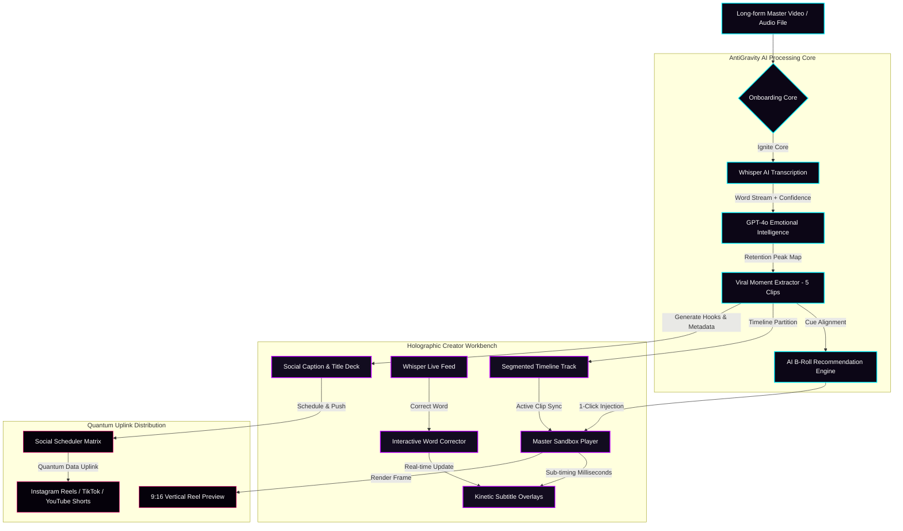
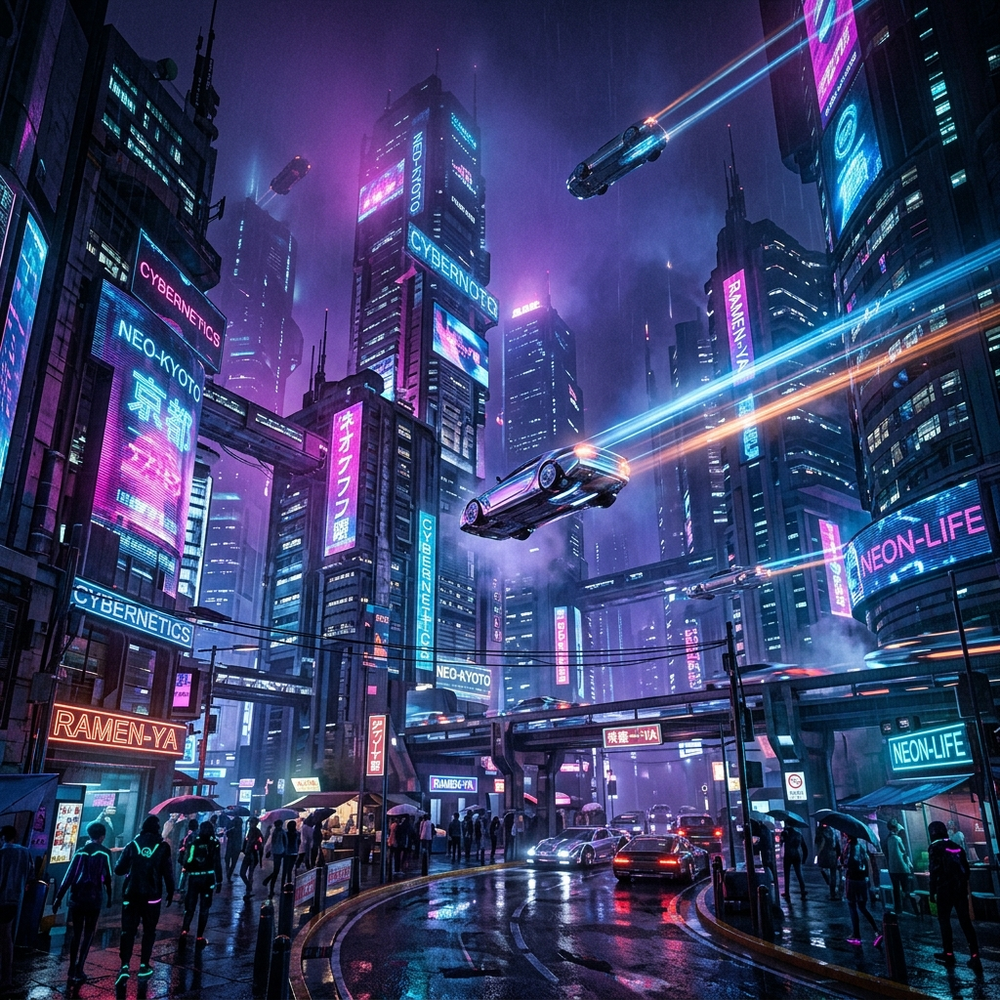

# ⚡ AntiGravity // Multimodal AI Content Engine

> Futuristic AI-powered creator studio that automatically transforms long-form video content into viral short-form social media assets.

---

## 🌌 Project Overview

**AntiGravity** is an immersive, high-fidelity cyberpunk-corporate creator dashboard designed to visualize and simulate an advanced multimodal AI production line. The system takes a 10-minute long master video and runs it through a series of cognitive pipelines:
1. **Whisper AI** streams real-time word-level transcription.
2. **GPT-4o** scans the auditory and visual indices for emotional peaks and high-retention cues.
3. The engine partitions the timeline into **five distinct viral clip segments** (complete with titles, confidence scores, and custom hooks).
4. Generative models match dynamic visual prompts and recommend **cinematic B-roll scenes**.
5. **Holographic telemetry** predicts performance scores (CTR, Share Index, and Retention curves).

---

## 📐 Workflow Architecture

The chart below shows how data flows through the AntiGravity core to transform master footage into multi-channel short assets:

---

## 🛠️ Tools & Technologies Used

- **Frontend Core**: Vanilla HTML5 (semantic layout architecture) & Modern ES6 Javascript (modular simulation core).
- **Styling**: Custom CSS Custom Properties (CSS variables) for real-time neon coloring, glassmorphism templates (`backdrop-filter`), flex/grid scaling, and scrolling scanline animations.
- **Audio Waveform Engine**: HTML5 Canvas rendering multi-layered frequency sine waves dynamically responding to player playback.
- **Analytics Visualization**: HTML5 Canvas graphing audience retention spikes and highlight partitions.
- **Icons**: FontAwesome v6 (vectorized tech interface icons).
- **Branding & Assets**: Advanced neural generative imaging (cinematic 8K resolution brand assets).

---

## 🔮 Key Features

- **Telemetry Core Dashboard**: Standby telemetry tracker streaming system load, active CUDA units, memory allocations, and model configurations.
- **Whisper Live feed**: Progressive word-by-word streaming transcript with live confidence indicators mapping speech anomalies.
- **Word-Level Subtitle Corrector**: Click on any word in the transcript feed to pause the video and open the editor corrector. Correcting a spelling propagates back to the video subtitles instantly.
- **Segmented Timeline Track**: Color-coded, relative timelines partition the master video based on emotional confidence indices. Clicking any segment updates the entire dashboard state.
- **AI Content Sidebar**: Auto-compiles platform captions filled with emojis, optimized hashtags, and interactive hooks (Curiosity, Bold Statement, Question Hooks).
- **B-Roll Deck**: Generates matching B-roll scenery, allowing creators to inject assets (cyberpunk skyline, neural server core, robot editors) with a single click.
- **Reels Mockup view**: An overlay viewport mock-up representing standard Instagram/TikTok feed frames, complete with interactive animated kinetic typography.

---

## 📸 Screenshots & Visuals

Here are some high-fidelity illustrations of the creator studio in action:

### 1. The Holographic Dashboard Sandbox
Preview the immersive studio workspace:

### 2. Corporate AI Strategist Assistant
The consciousness powering the hooks analyzer:

### 3. Suggested Cinematic B-Roll Channels
Cinematic assets matched dynamically based on generative script cues:

| City Skyline (Clip 1) | Neural Server (Clip 2) | Humanoid Editor (Clip 3) |
| :---: | :---: | :---: |
|  |  |  |

---

## 🚀 Future Scope

- **Real Audio API integration**: Integrate actual Whisper APIs and serverless node audio pipelines to support active drag-and-drop transcribe flows.
- **Serverless Video Processing**: Incorporate `ffmpeg.wasm` directly inside the browser sandbox to slice, overlay subtitles, and stitch recommended B-roll clips client-side.
- **Platform Webhooks**: Establish OAuth connections to Instagram Business, TikTok Creator, and YouTube APIs to automate scheduling and publishing with a single click.
- **Advanced Dynamic Subtitles**: Expand the subtitle library with more dynamic layout variations, including standard text paths, sound effect overlays, and animated speech tags.
