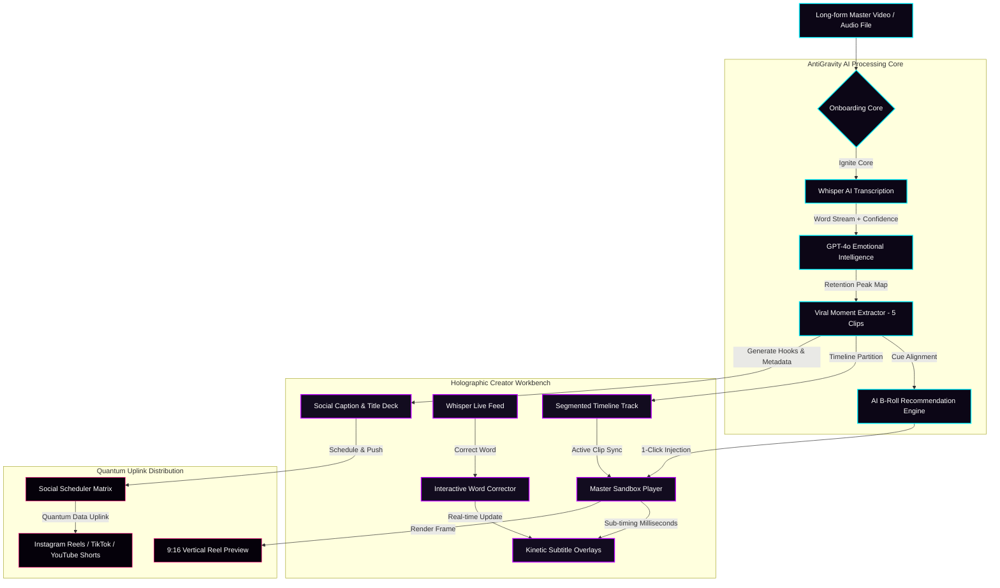
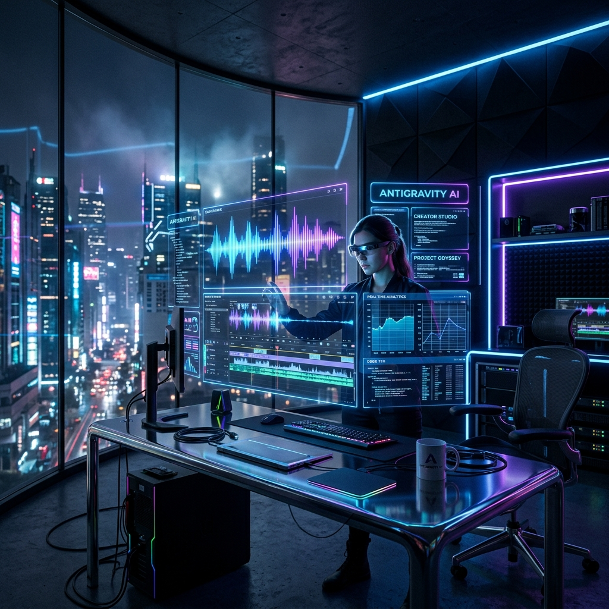
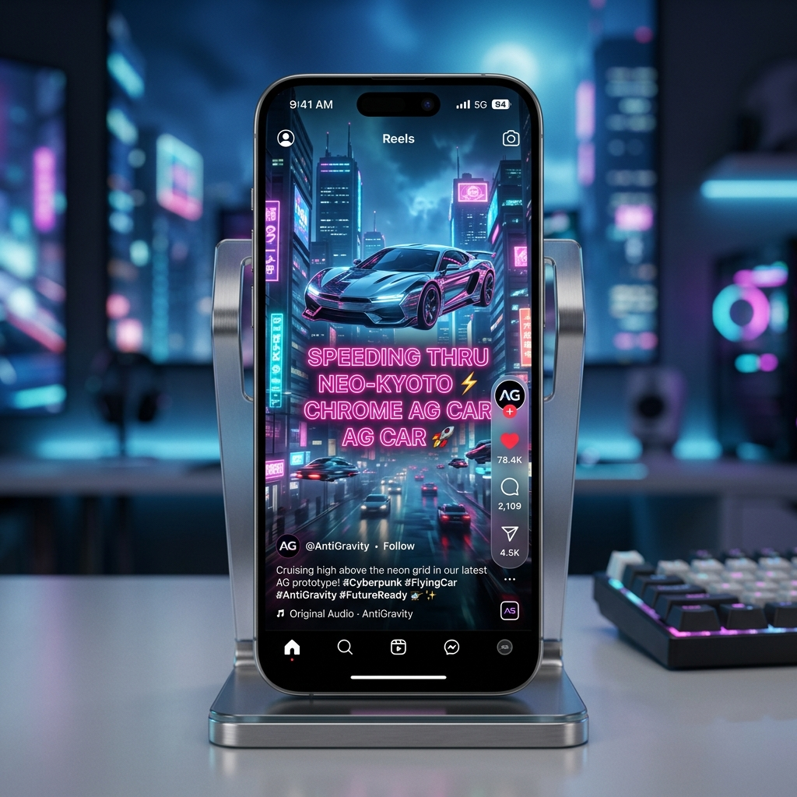
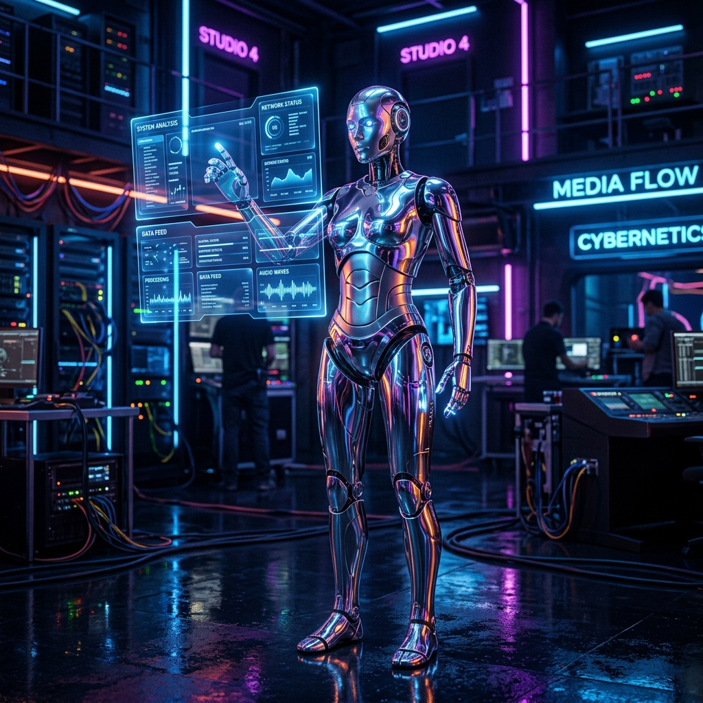
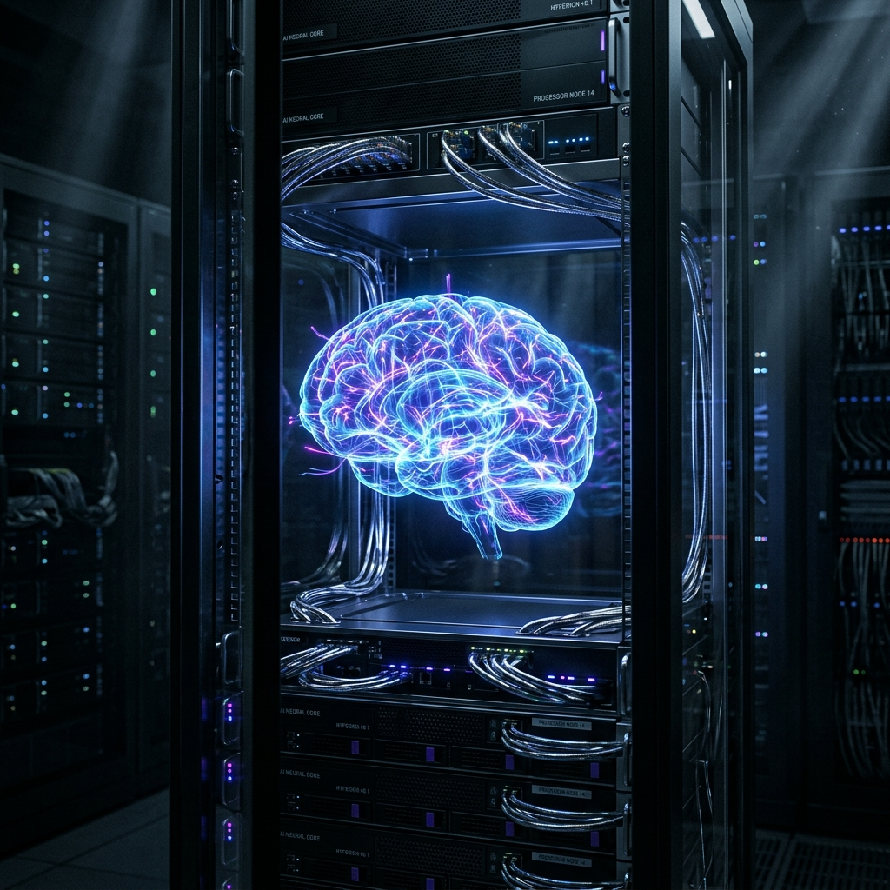
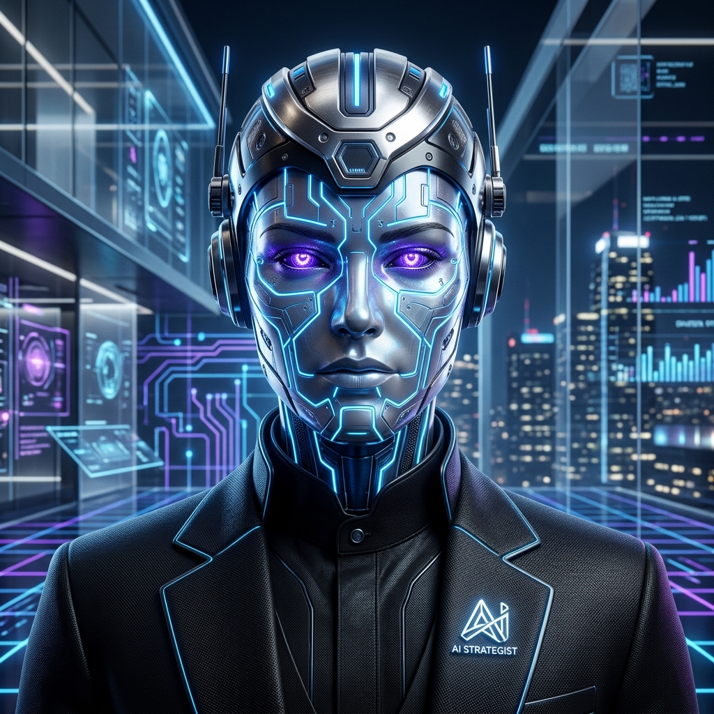

# ⚡ AntiGravity // Multimodal AI Content Engine

> Futuristic AI-powered creator studio that automatically transforms long-form video content into viral short-form social media assets.

---

## 🌌 Project Overview

**AntiGravity** is an immersive, high-fidelity cyberpunk-corporate creator dashboard designed to visualize and simulate an advanced multimodal AI production line. The system takes a 10-minute long master video and runs it through a series of cognitive pipelines:
1. **Whisper AI** streams real-time word-level transcription.
2. **GPT-4o** scans the auditory and visual indices for emotional peaks and high-retention cues.
3. The engine partitions the timeline into **five distinct viral clip segments** (complete with titles, confidence scores, and custom hooks).
4. Generative models match dynamic visual prompts and recommend **cinematic B-roll scenes**.
5. **Holographic telemetry** predicts performance scores (CTR, Share Index, and Retention curves).

---

## 📐 Workflow Architecture

The chart below shows how data flows through the AntiGravity core to transform master footage into multi-channel short assets:

---

## 🛠️ Tech Stack Section

The **AntiGravity AI** creator studio is built using a highly focused, high-performance technology stack split across three distinct operational layers:

### 1. AI & Cognitive Modeling Layers
* **Speech-to-Text Model**: **Whisper AI** — Processes high-speed audio signals, streaming real-time word-level transcription matrices with precise timestamp offset bounds and word-level confidence indices.
* **Emotion & Hook Extraction**: **GPT-4o (Cognitive Engine)** — Evaluates semantic text data alongside timeline telemetry to identify the top 5 high-retention "emotional peak" moments, auto-compiles multi-platform hook options, and scores potential CTR impact.

### 2. Interactive Media Synthesis
* **Web Audio Canvas Engine**: **Native HTML5 Canvas API** — Renders reactive, multi-layered visual soundwaves and audio frequency sine waves that animate and morph dynamically in sync with video playback speeds.
* **Predictive Performance heatmaps**: **Native HTML5 Canvas API** — Graphs audience retention drop-offs, highlighting the exact viral moment slice region.
* **Generative Media Asset Library**: **Generative Image Engine** — Visualizes 8K photorealistic dashboards, strategist characters, and cinematic vertical B-roll recommendations inside the studio database.

### 3. Holographic Frontend Shell
* **Styling & Layout**: **Vanilla CSS (CSS Custom Properties)** — Employs a zero-dependency cyberpunk styling framework leveraging glassmorphic blurring (`backdrop-filter`), cybernetic button structures (`clip-path`), glowing border keyframes, and neon scrolling scanlines.
* **Interface Blueprint**: **Inline SVG Core & FontAwesome v6** — Powers animated, glowing network schemas displaying high-speed data flow packet paths between processing units in real-time.
* **Behavior Logic Controller**: **Modular Vanilla ES6+ Javascript** — Orchestrates the simulation timelines, handles transcription streams, synchronizes subtitles, binds interactive text correctors, and routes publishing scheduler feeds.

---

## 🔮 Key Features

Here is a high-level highlight matrix of the engine's core capabilities:

* ✔ **AI Speech-to-Text Transcription** — Progressive Whisper models streaming frame-exact vocal transcript segments.
* ✔ **Viral Segment Detection** — GPT-4o mapping active emotional peaks to extract high-retention short clips.
* ✔ **Automated Reel Captioning** — Live synchronization of kinetic neon subtitle presets matching millisecond offsets.
* ✔ **AI B-roll Recommendations** — Prompt alignment pipelines matching generative studio visual assets to target timeline cues.
* ✔ **Multimodal Content Pipeline** — A unified workflow translating long master assets into copy-ready social bundles.
* ✔ **Social Media Automation** — Scheduled secure packet broadcaster simulations routing reels directly across social matrices.

### Detailed Workspace Specifications

- **Telemetry Core Dashboard**: Standby telemetry tracker streaming system load, active CUDA units, memory allocations, and model configurations.
- **Whisper Live feed**: Progressive word-by-word streaming transcript with live confidence indicators mapping speech anomalies.
- **Word-Level Subtitle Corrector**: Click on any word in the transcript feed to pause the video and open the editor corrector. Correcting a spelling propagates back to the video subtitles instantly.
- **Segmented Timeline Track**: Color-coded, relative timelines partition the master video based on emotional confidence indices. Clicking any segment updates the entire dashboard state.
- **AI Content Sidebar**: Auto-compiles platform captions filled with emojis, optimized hashtags, and interactive hooks (Curiosity, Bold Statement, Question Hooks).
- **B-Roll Deck**: Generates matching B-roll scenery, allowing creators to inject assets (cyberpunk skyline, neural server core, robot editors) with a single click.
- **Reels Mockup view**: An overlay viewport mock-up representing standard Instagram/TikTok feed frames, complete with interactive animated kinetic typography.

---

## 📸 Screenshots & UI Mockups

Here is a high-fidelity visual showcase of the **AntiGravity** workspace platforms, showing detailed layouts of active screens:

### 1. AI Dashboard Screen
*Epic, ultra-realistic visual of the holographic AntiGravity workspace sandbox and timeline interfaces:*

### 2. Reel Preview Mockup Screen
*Sleek 9:16 vertical smartphone view presenting the active short-form reel with floating kinetic caption titles and social overlay metrics:*

### 3. Transcript Interface Screen
*High-precision display of the Whisper AI transcription core, tracking speech timelines and synchronizing active word corrections:*

### 4. Viral Clip Detection Screen
*Volumetric neural mapping of audience retention curves and emotional index splits powered by GPT-4o analytics:*

### 5. Corporate AI Strategist Character
*High-end humanoid strategist avatar optimizing hook presets and publishing matrices:*

---

## 🚀 Future Enhancements

We are actively developing and expanding the AntiGravity engine capabilities. Future roadmap integrations include:

* 🚀 **Auto Video Clipping** — Server-side or client-side video cropping using `ffmpeg.wasm` to automatically frame and slice high-engagement segments.
* 🗣 **AI Voice Cloning** — Synthesizing natural corporate and branding voices from short 10-second reference audio recordings.
* 🌐 **Multi-Language Subtitle Generation** — Instant transcription translation and kinetic subtitles generation across 24+ languages.
* 📱 **TikTok/Reels Auto Publishing** — Direct social platform API webhooks to publish and schedule short-form assets with a single click.
* 📊 **Engagement Prediction Analytics** — Deep predictive machine learning models to forecast real audience view ranges and comments ratios prior to publishing.

### Core Architecture Roadmap

- **Real Audio API integration**: Connect live Whisper APIs and serverless node audio transcribing models to process direct file drops.
- **Serverless Video Processing**: Incorporate browser sandboxed WebAssembly compilers (`ffmpeg.wasm`) to slice timelines client-side.
- **Platform Webhooks**: Establish secure OAuth connections to Instagram Business, TikTok Creator, and YouTube social APIs to fully automate publication feeds.
- **Advanced Dynamic Subtitles**: Expand kinetic typography layout libraries with custom speech tracking presets, volumetric overlays, and sound-reactive fonts.

---

## ⚖️ License

Distributed under the MIT License. See [LICENSE](LICENSE) for more information.
